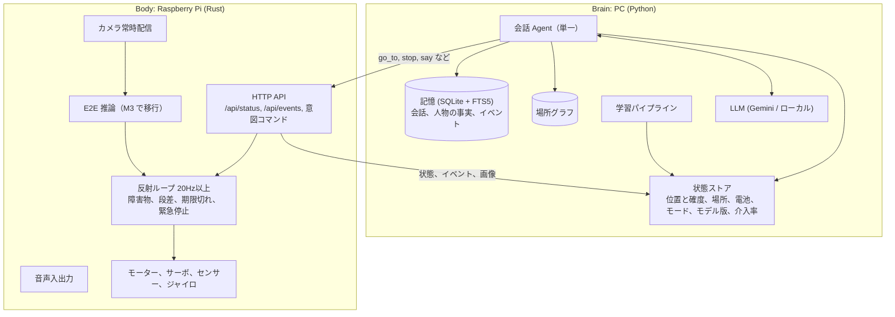

# PiCar-X アーキテクチャ方針書

本書は、Raspberry Pi 5（Body）と PC（Brain）に分けた **目標構成** と、その判断理由を定める。

> [!IMPORTANT]
> 本書の多くは **未実装の目標** である。現行の動作は [APPLICATION_SPECIFICATION.md](APPLICATION_SPECIFICATION.md) と [E2E_SPECIFICATION.md](E2E_SPECIFICATION.md)、計画と決定事項は [ROADMAP.md](ROADMAP.md) を参照する。

---

## 1. 基本方針

- **Body と Brain を分ける**
  - **Body（Pi / Rust）**: モーター、センサー、カメラ、音声入出力、安全機能、走行推論
  - **Brain（PC / Python）**: 会話 Agent、状態の集約、記憶、場所の理解、学習
- **安全は Body が単独で保つ**: Wi-Fi の切断や Brain の停止時も、Body が自律的に停止する
- **Brain は意図だけを送る**: LLM はモーターを直接動かさない。Body は要求を拒否できる
- **PC は使用時のみ起動する**: PicarX を使う時は PC も利用可能なので、常時起動は前提にしない（ROADMAP の D-2）。PC がなければ Body は停止して待機する
- **クラウドへ送るデータを限定する**: 現行の Gemini 利用は意図したもので問題なし。LLM は Gemini を既定とし、PC のローカル LLM を代替にする。画像や音声など、新しい種類のデータをクラウドへ送る機能は、追加前に確認する（ROADMAP の D-3）

---

## 2. 目標構成


```mermaid
flowchart TB
    subgraph Brain["Brain: PC (Python)"]
        direction TB
        Agent["会話 Agent（単一）"]
        State["状態ストア<br>位置と確度、場所、電池、モード、モデル版、介入率"]
        Memory[("記憶 (SQLite + FTS5)<br>会話、人物の事実、イベント")]
        Places[("場所グラフ")]
        Train["学習パイプライン"]
        LLM["LLM (Gemini / ローカル)"]

        Agent --> State
        Agent --> Memory
        Agent --> Places
        Agent <--> LLM
        Train --> State
    end

    subgraph Body["Body: Raspberry Pi (Rust)"]
        direction TB
        API["HTTP API<br>/api/status, /api/events, 意図コマンド"]
        Reflex["反射ループ 20Hz以上<br>障害物、段差、期限切れ、緊急停止"]
        Drive["E2E 推論（M3 で移行）"]
        Camera["カメラ常時配信"]
        Audio["音声入出力"]
        HW["モーター、サーボ、センサー、ジャイロ"]

        API --> Reflex
        Drive --> Reflex
        Camera --> Drive
        Reflex --> HW
    end

    Agent -- "go_to, stop, say など" --> API
    API -- "状態、イベント、画像" --> State
```

---

## 3. 判断と理由

### 3.1 安全機能を Pi に置く

現行の走行ループは PC 側で約1Hzのため、段差や障害物への反応が遅れる。Wi-Fi の遅延に影響されない Pi 内のループで監視する。

### 3.2 単一 Agent にする

現行の Drive、Vision、Voice ノードはグラフ上で到達不能である。計算資源が限られる環境ではモデル呼び出しを増やす構成の利点が小さいので、単一 Agent と少数のツールにする。

### 3.3 状態はプロンプトへ毎回注入する

小さなローカル LLM でもツール呼び出しに依存せずに状況を把握でき、呼び出し回数も減らせる。

### 3.4 記憶は SQLite + FTS5 から始める

追加サービスなしで動き、日本語検索はトリグラムで対応できる見込みである（要検証）。検索品質が不足した場合にベクトル検索を検討する。

### 3.5 LLM は Gemini を既定とし、ローカルを代替にする

Gemini は応答の品質と速度に優れる。一方で通信断やクォータ超過（429）があるので、PC のローカル LLM を代替にする。PC は GPU なしの Core i7-1255U なので、モデルは応答時間の実測で選ぶ。Pi 5 のメモリは LLM に使わず、走行、安全、音声入出力に充てる。

### 3.6 クラウドへ送るデータを限定する

どのクラウドでも安全性を 100% 担保することはできない。Gemini API の規約（2026-03-23 発効版を確認）では、無料枠の入出力は製品改善に使われ、人が閲覧する場合がある。有料枠でも、不正利用の検知のため一定期間ログが保存される。この点を理解したうえで現行の利用を継続する。室内画像や音声など新しい種類のデータを送る機能は、追加前に確認する。

### 3.7 音声処理の場所は性能で決める

旧版は「音声は重いので通信に載せない」としていたが、16kHz モノラル PCM は約256kbps であり、帯域は決定的な理由にならない。LAN 内の PC か Pi 5 のどちらで動かすかを実測で決める。候補は PC または Pi の Whisper で、Vosk も比較する。

最初は PC のマイクで開発する。車載マイクは M6 で装着し、モーター音と自声への対策を行う。

### 3.8 自己位置は場所のつながりで持つ

前方超音波1本と推測航法では家全体の精密地図を作れない。まずカメラのみで場所を認識し、場所グラフとして持つ。精度が足りない場合に限り、印刷した AprilTag とジャイロを M6 で追加する。占有格子は近傍の回避と可視化に限定する。

---

## 4. インターフェース

### 4.1 現行 API（抜粋）

| 用途 | 要求 | 応答 |
|---|---|---|
| 走行 | `POST /api/drive/move` `{"direction":"forward","speed":30,"duration_ms":1000}` | `{"status":"ok"}` |
| 緊急停止 | `POST /api/drive/emergency_stop`、`POST /api/drive/emergency_stop/reset` | `{"status":"ok"}` |
| 距離 | `GET /api/sensor/ultrasonic` | `{"distance_cm":35.4}` |
| 発話 | `POST /api/audio/speak` `{"text":"..."}` | `{"status":"ok"}` |
| 画像 | `GET /api/camera/snapshot` | `{"image_base64":"...","width":320,"height":240}` |

全要求で Bearer トークンが必須である。一覧は [APPLICATION_SPECIFICATION.md §7](APPLICATION_SPECIFICATION.md) を参照する。

### 4.2 目標 API（未実装の案）

```json
GET /api/status
{
  "time": "2026-11-03T12:00:00Z",
  "mode": "idle",
  "battery": {"voltage": 7.6, "percent": 50, "age_ms": 120},
  "ultrasonic": {"distance_cm": 35.4, "age_ms": 40, "valid": true},
  "grayscale": {"values": [800, 790, 810], "age_ms": 40, "valid": true},
  "safety": {"estop": false, "last_event": "obstacle_stop"}
}
```

```json
POST /api/drive/command
{"speed": 30, "steer": 5, "ttl_ms": 300}
```

---

## 5. 計画

実施順序と完了条件は [ROADMAP.md](ROADMAP.md) で一元管理する。
